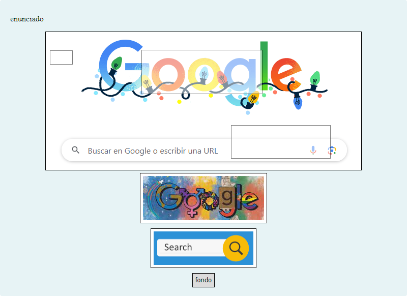
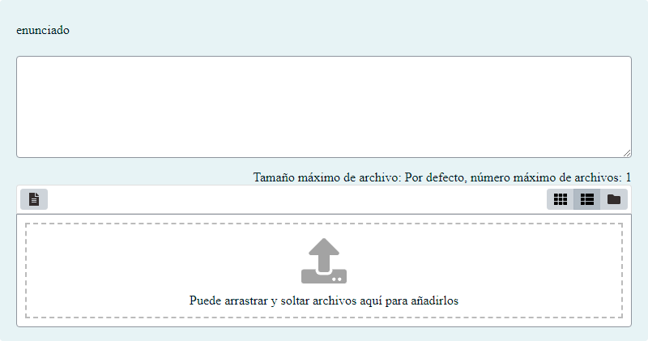
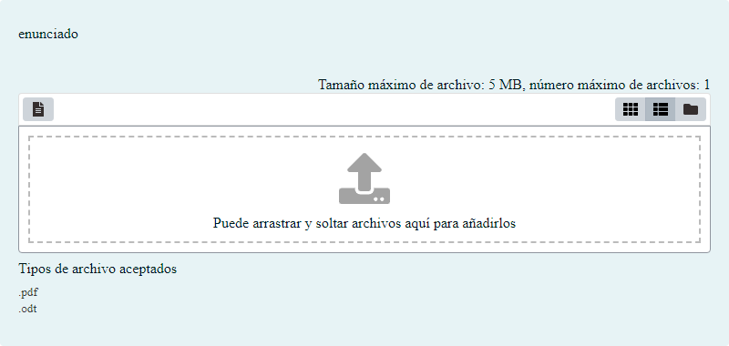
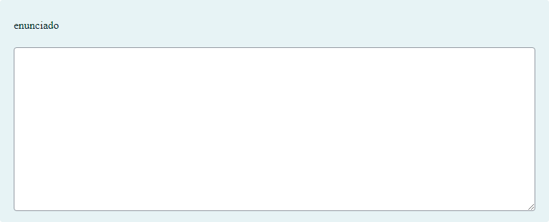
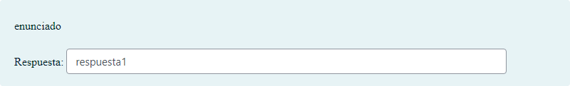

# Test

Test para probar el funcionamiento del organizador de actividades

## Contenido

Ficheros de preguntas disponibles en esta actividad:

### [questions.xml](https://github.com/iescanarias/actividades/tree/main/.actirepo/test/questions.xml)

|   | Tipo              | Cantidad                   |
| - | ----------------- | -------------------------- |
|  | [Arrastrar y soltar sobre una imagen](#arrastrar-y-soltar-sobre-una-imagen) | 1 |
|  | [Arrastrar y soltar marcadores](#arrastrar-y-soltar-marcadores) | 1 |
|  | [Ensayo](#ensayo) | 3 |
|  | [Emparejamiento](#emparejamiento) | 1 |
|  | [Asociación](#asociación) | 1 |
|  | [Opción múltiple](#opción-múltiple) | 2 |
|  | [Numérico](#numérico) | 1 |
|  | [Respuesta corta](#respuesta-corta) | 1 |
|  | [Verdadero/Falso](#verdaderofalso) | 3 |
|   | **TOTAL**         | 14 |

#### Arrastrar y soltar sobre una imagen

#### Arrastrar y soltar marcadores

#### Ensayo

#### Opción múltiple

#### Respuesta corta

#### Verdadero/Falso

