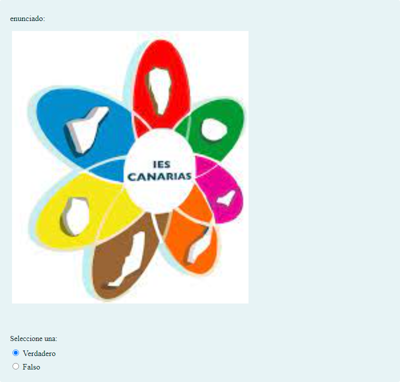

# Test

Test para probar el funcionamiento del organizador de actividades

## Contenido

Preguntas disponibles en esta actividad:

|   | Tipo              | Cantidad                   |
| - | ----------------- | -------------------------- |
|  | Respuesta corta | 1 |
|  | Opción múltiple | 2 |
|  | Verdadero/Falso | 3 |
|  | Emparejamiento | 1 |
|  | Asociación | 1 |
|  | Arrastrar y soltar sobre una imagen | 1 |
|  | Arrastrar y soltar marcadores | 1 |
|  | Ensayo | 3 |
|  | Numérico | 1 |
|   | **TOTAL**         | 14 |

## Descargas

- [questions.xml](https://github.com/iescanarias/actividades/tree/main/./.actirepo/test/questions.xml)

## Ejemplos

### questions.xml

