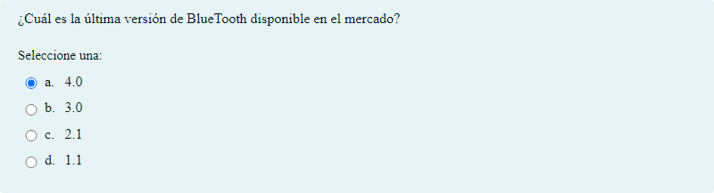
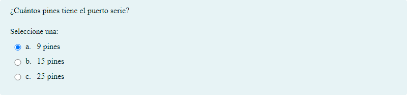
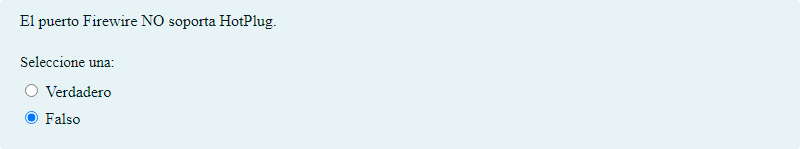

# Conectores y buses externos

## Contenido

Ficheros de preguntas disponibles en esta actividad:

### [conextores y buses externos.xml](conextores y buses externos.xml)

|   | Tipo              | Cantidad                   |
| - | ----------------- | -------------------------- |
|  | [Selección múltiple](#selección-múltiple) | 127 |
|  | [Verdadero/Falso](#verdaderofalso) | 3 |
|   | **TOTAL**         | 130 |

#### Selección múltiple

#### Verdadero/Falso

