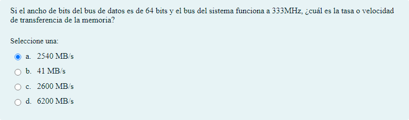

# Memoria ram

## Contenido

Ficheros de preguntas disponibles en esta actividad:

### [la memoria ram.xml](la memoria ram.xml)

|   | Tipo              | Cantidad                   |
| - | ----------------- | -------------------------- |
|  | [Selección múltiple](#selección-múltiple) | 199 |
|  | [Verdadero/Falso](#verdaderofalso) | 8 |
|   | **TOTAL**         | 207 |

#### Selección múltiple

#### Verdadero/Falso

