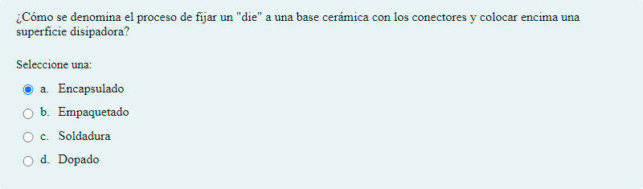

# El microprocesador

Preguntas tipo test, de asociación y de respuesta corta sobre el microprocesador

## Contenido

Ficheros de preguntas disponibles en esta actividad:

### [questions.xml](https://github.com/iescanarias/actividades/tree/main/hardware/microprocesador/el%20microprocesador/questions.xml)

|   | Tipo              | Cantidad                   |
| - | ----------------- | -------------------------- |
|  | Opción múltiple | 70 |
|  | Verdadero/Falso | 8 |
|  | Emparejamiento | 7 |
|  | Respuesta corta | 3 |
|   | **TOTAL**         | 88 |

#### Verdadero/Falso

#### Respuesta corta

