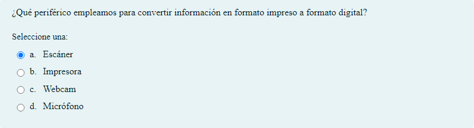
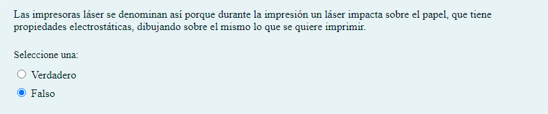
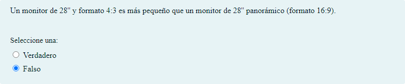

# Periféricos y tarjetas de expansión

## Contenido

Ficheros de preguntas disponibles en esta actividad:

### [periféricos y tarjetas de expansión.xml](periféricos y tarjetas de expansión.xml)

|   | Tipo              | Cantidad                   |
| - | ----------------- | -------------------------- |
|  | [Selección múltiple](#selección-múltiple) | 37 |
|  | [Verdadero/Falso](#verdaderofalso) | 6 |
|   | **TOTAL**         | 43 |

#### Selección múltiple

#### Verdadero/Falso

