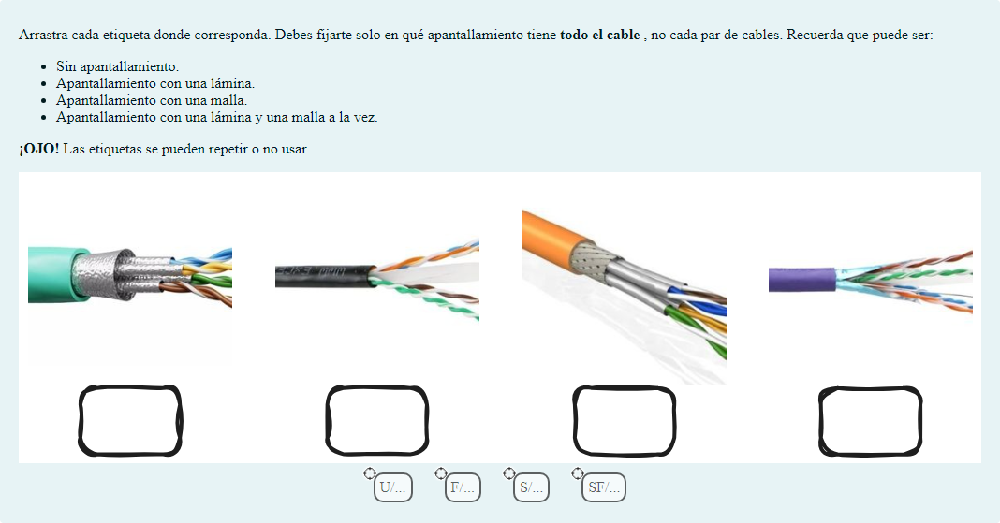
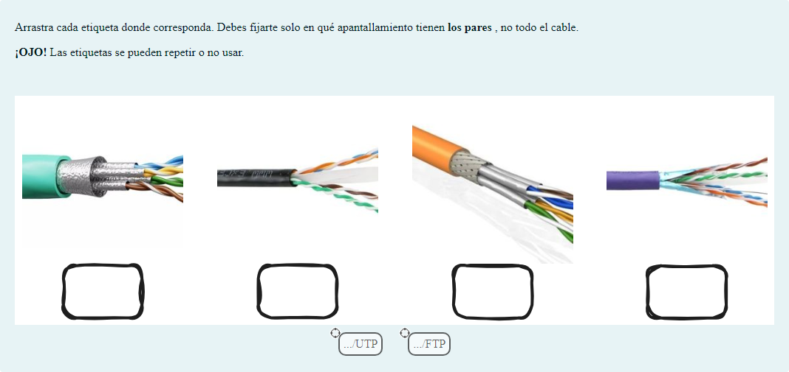
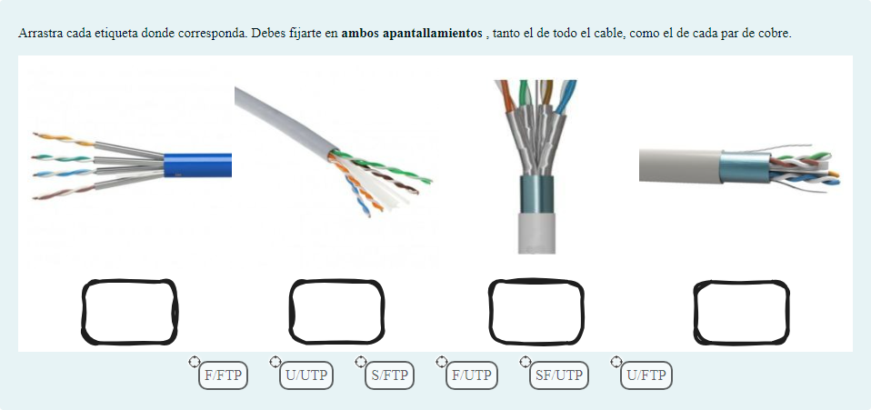
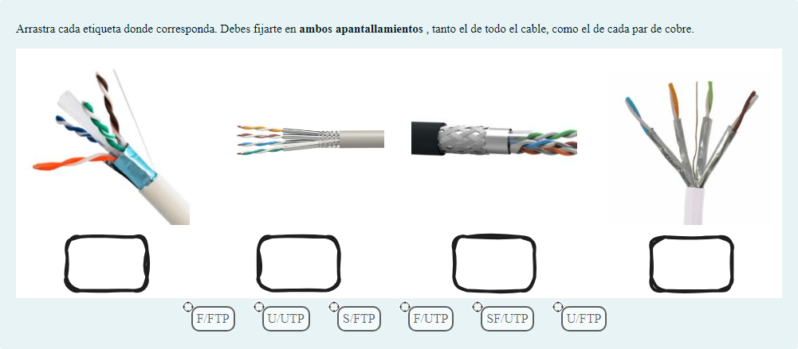
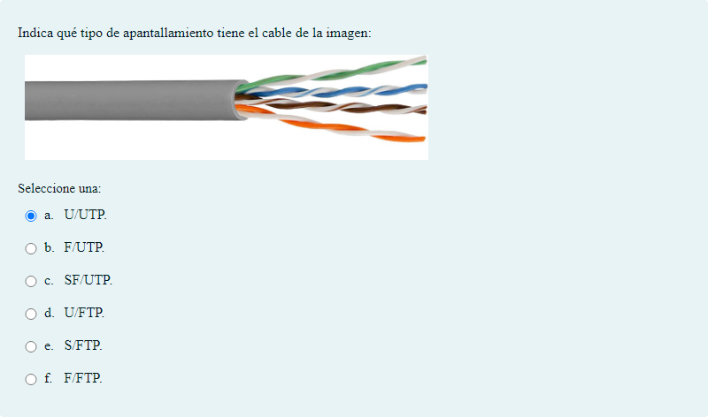
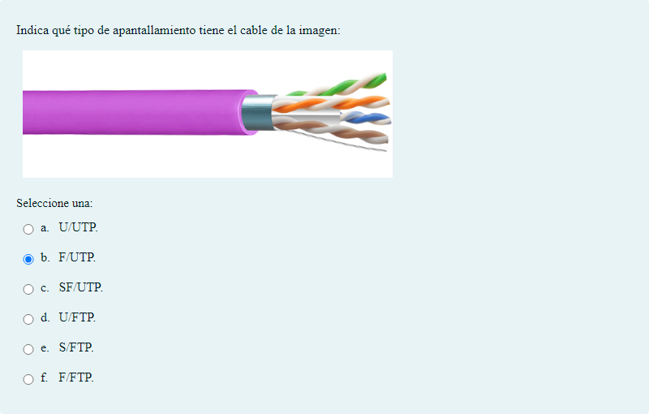
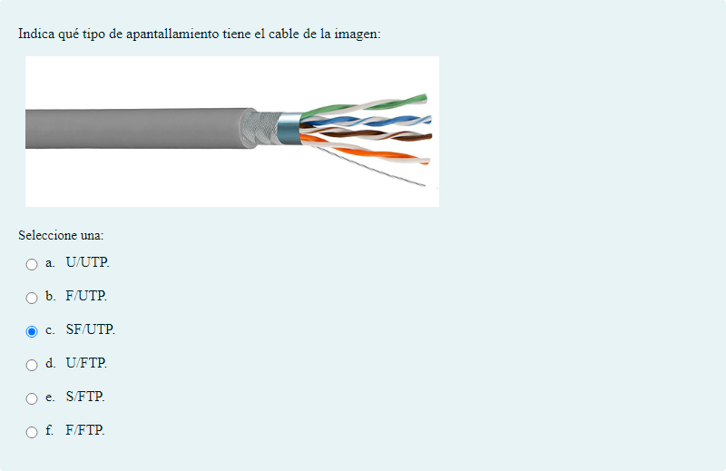
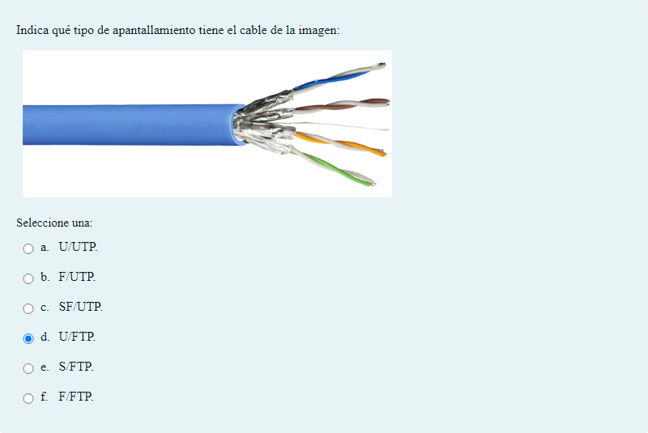
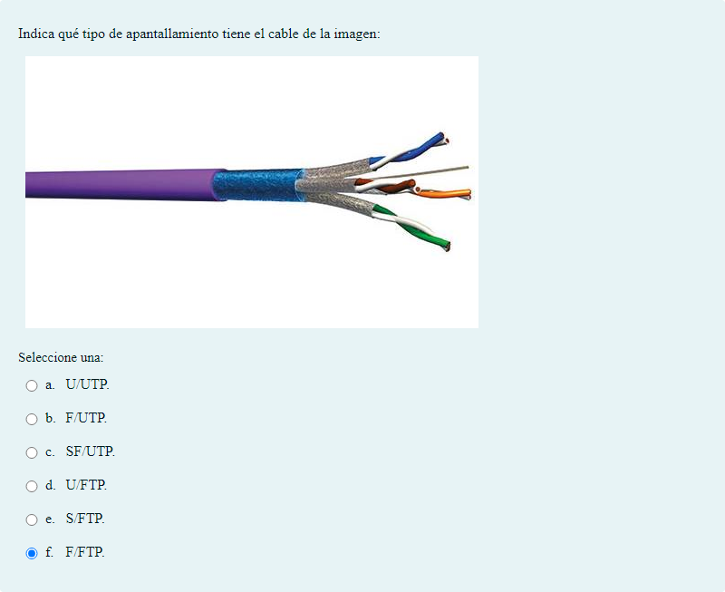

# Tipos de apantallamiento

Preguntas de opción múltiple y de arrastrar y soltar marcadores

## Contenido

Ficheros de preguntas disponibles en esta actividad:

### [apantallamiento.xml](https://github.com/iescanarias/actividades/tree/main/redes/cableado/apantallamiento/apantallamiento.xml)

|   | Tipo              | Cantidad                   |
| - | ----------------- | -------------------------- |
|  | [Arrastrar y soltar marcadores](#arrastrar-y-soltar-marcadores) | 4 |
|  | [Opción múltiple](#opcion-multiple) | 6 |
|   | **TOTAL**         | 10 |

#### Arrastrar y soltar marcadores

#### Opción múltiple

