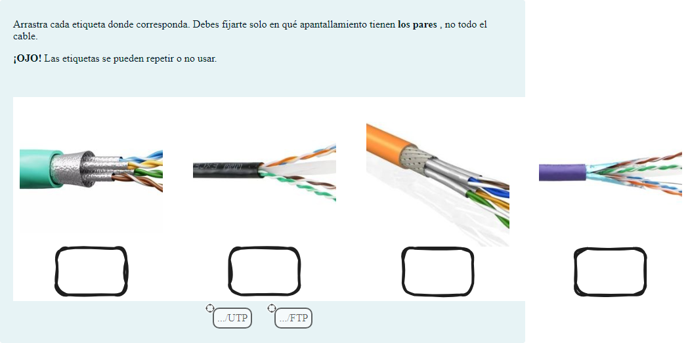

# Tipos de apantallamiento

Preguntas de opción múltiple y de arrastrar y soltar marcadores

## Contenido

Ficheros de preguntas disponibles en esta actividad:

### [apantallamiento.xml](apantallamiento.xml)

|   | Tipo              | Cantidad                   |
| - | ----------------- | -------------------------- |
|  | [Arrastrar y soltar marcador](#arrastrar-y-soltar-marcador) | 4 |
|  | [Selección múltiple](#selección-múltiple) | 6 |
|   | **TOTAL**         | 10 |

#### Arrastrar y soltar marcador

#### Selección múltiple

