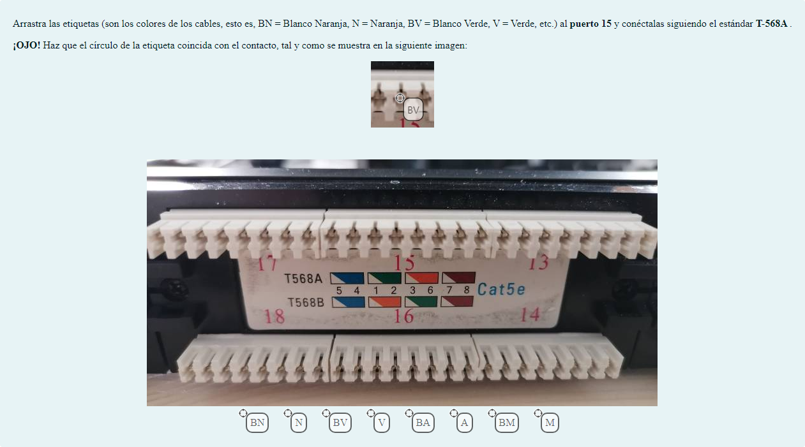

# Normas T-568A y T-568B

Preguntas de arrastrar y soltar sobre una imagen y de arrastrar y soltar marcadores

## Contenido

Ficheros de preguntas disponibles en esta actividad:

### [normas T-568A y T-568B.xml](https://github.com/iescanarias/actividades/tree/main/redes/cableado/normas%20T-568A%20y%20T-568B/normas%20T-568A%20y%20T-568B.xml)

|   | Tipo              | Cantidad                   |
| - | ----------------- | -------------------------- |
|  | Arrastrar y soltar sobre una imagen | 7 |
|  | Arrastrar y soltar marcadores | 5 |
|   | **TOTAL**         | 12 |

#### Arrastrar y soltar marcadores

